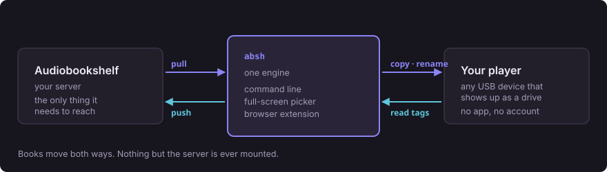

# Audiobookshelf Helper

Copy books between [Audiobookshelf](https://audiobookshelf.org) and any USB
player that shows up as a drive — and copy side-loaded books back the other way.

<p align="center"></p>

No app on the device, no account, no SMB or NFS mount. Everything goes through
the Audiobookshelf API: if you can open your server in a browser, `absh` can
use it.

## `absh` is the whole tool

A Python program with a command line and a full-screen picker. It needs no
browser at all.

```bash
absh status          # what is where
absh pull redwall    # server -> device
absh push --all      # device -> server
absh tui             # pick interactively
```

The browser extension is a front-end for exactly that engine — the same code,
not a second implementation. It puts badges on the book cards in Audiobookshelf
itself and adds buttons to copy, upload or delete without leaving the page.

Firefox and Chrome. The Python side runs on macOS, Linux and Windows.

## Every book is in one of three states

<p align="center"></p>

That third state is the interesting one. A book that is only on the device —
ripped, side-loaded, inherited from an older player — is identified from the
tags inside the file, and can be uploaded into your library.

## Install

### Just the command line

Nothing to install. Python 3.9+ and the repository is enough:

```bash
git clone https://github.com/dadatuputi/audiobookshelf-helper.git
cd audiobookshelf-helper

python3 -m absh.cli devices     # what is plugged in, and where
python3 -m absh.cli config --url http://media.local:13378 --key <api key> \
                           --device PLAYER
python3 -m absh.cli doctor      # checks every moving part
python3 -m absh.cli status
```

`--device` takes a full path *or* just the volume name, so `--device PLAYER`
works without anyone remembering whether this OS mounts it under `/Volumes`,
`/media/you` or `/run/media/you`.

`pip install mutagen` is optional and improves tag reading on unusual files;
everything works without it.

### Plus the extension

Grab the [latest release](https://github.com/dadatuputi/audiobookshelf-helper/releases)
or [build it yourself](#building-locally). Either way, register the helper so
the browser knows where to find it:

```bash
python3 native/install.py
```

Then load the extension:

- **Firefox** — `about:debugging#/runtime/this-firefox` → Load Temporary Add-on
  → `extension/dist/firefox/manifest.json`. Temporary add-ons unload on
  restart; a signed `.xpi` from the releases page installs permanently.
- **Chrome** — `chrome://extensions` → Developer mode → Load unpacked →
  `extension/dist/chrome`

`install.py` takes `--dry-run` and `--uninstall`. On Windows it points the
browser at a generated `.bat`, because Windows browsers cannot execute a `.py`
directly.

## Configure

Toolbar icon → ⚙, or `absh config`, or <kbd>s</kbd> in the TUI. All three write
the same file.

| Setting | Notes |
|---|---|
| Audiobookshelf URL | e.g. `http://media.local:13378` |
| **Grant access** | Extension only. Required — [see below](#the-permission-grant) |
| API key | Audiobookshelf → Settings → API Keys |
| Device path | Absolute, e.g. `/Volumes/PLAYER` or `E:\`. **Detect** lists what is plugged in |
| Folder on device | `AUDIOBOOKS` by default. Some players give a named folder resume and bookmarks — check your manual |
| Folder template | `{author}` `{title}` `{series}`. Also how a book is recognised on the device, so changing it makes synced books look absent |
| Rename m4b → m4a | Leave on unless your player handles `.m4b` |

### The permission grant

The extension ships with **no host permissions and no content script**. On a
fresh install it can reach no site at all — check `chrome://extensions`, site
access is empty.

Because Audiobookshelf is self-hosted, its address isn't knowable at build time.
So *Grant access* computes the single origin pattern for the URL you typed
(`http://media.local:13378/*`) and requests only that. The toolbar button is
then registered at runtime for that origin's `/library/*` pages.

This is why the manifest lists `*://*/*` under `optional_host_permissions` and
never requests it as written.

## Use

### From the command line

```bash
absh devices             # find the device
absh status              # the three-way picture
absh ls                  # what is on the device
absh pull redwall holes  # match on title, author or series
absh pull --all
absh push --all          # upload everything the server does not have
absh rm redwall          # asks first; -y to skip
absh tui                 # full-screen picker
absh doctor              # why isn't it working
```

Every command takes `--dry-run`. `pull` skips books already on the device
*before* downloading them, so `absh pull --all` is cheap to re-run; pass
`--force` to fetch them again anyway.

In the TUI: <kbd>space</kbd> selects, <kbd>/</kbd> filters, <kbd>p</kbd> pulls,
<kbd>u</kbd> pushes, <kbd>d</kbd> deletes, <kbd>r</kbd> refreshes,
<kbd>s</kbd> opens settings, <kbd>q</kbd> quits. Settings is also where you pick
the device from a list of what is mounted, so the TUI is usable before anything
is configured beyond the server.

### In Audiobookshelf

Each book card gets a badge showing whether it is on your device, with a button
to copy it there or take it off. Books on the device but *not* in your library
appear in a panel with an **Upload** button.

### In the popup

Three tabs over the same status: **To pull**, **On device**, **To push**. Tick
and act. Progress streams per file.

## Finding the device

There is no reliable, dependency-free way to ask an OS "which of these is a USB
audio player", so nothing here pretends to. Instead it lists the removable
volumes that *are* mounted and ranks them by how player-like they look — a
volume that already has your books folder wins outright, one this tool has
synced to before is next, and a small volume beats a large one. You pick.

```
  VOLUME                     SIZE     FREE  PATH
* PLAYER                    7.4GB    2.1GB  /Volumes/PLAYER  AUDIOBOOKS/ (12 items)
  Time Machine              2.0TB    412GB  /Volumes/Time Machine
```

All three front-ends offer it: `absh devices`, <kbd>s</kbd> in the TUI, and the
**Detect** button on the extension's options page.

On macOS the boot volume is deliberately skipped: it appears under `/Volumes` as
a symlink to `/`, and offering it as a "device" would point `remove` at your
whole filesystem.

## How books are matched

The hard part of two-way sync is deciding that a folder on a USB stick *is* a
given library item. Three steps, in order:

1. **The sidecar index.** Whenever this tool puts a book on a device it records
   the item id in `<device>/.absh/index.json`. Exact and instant.
2. **The expected name.** A folder matching what the template would have
   produced.
3. **Embedded tags.** Title and author read from the file itself, normalised so
   "The Hobbit"/"J.R.R. Tolkien" and "Hobbit, The"/"JRR Tolkien" agree.

A book is only reported as *device only* — and offered for upload — once all
three have failed to find it on the server. That is what stops a hand-copied
file with a scruffy name being uploaded when your library already has it.

Deleting the index is harmless; matching just falls back to tags.

## Building locally

**From a fresh clone, in the repo root, this is the whole thing:**

```bash
python3 extension/build.py     # -> extension/dist/firefox, extension/dist/chrome
python3 native/install.py      # register the helper, then restart the browser
```

No `npm install`, no bundler — the extension builds with **Python alone**. Node
is only for the tests and linters.

> **Where did it go?** `extension/dist/`, not `dist/`. It is gitignored, so it
> will not appear in `ls` at the repo root. The build prints the full path and
> the load instructions when it finishes.

`--target firefox` or `--target chrome` builds just one. Re-run after any change
under `extension/src/` and press reload in the browser; there is no watch mode
because the build is a file copy plus a generated manifest and takes about a
tenth of a second.

### The release artefacts, byte-for-byte

`tools/package.py` is the same script the release workflow runs:

```bash
python3 tools/package.py                       # stamped v0.0.0, into release/
python3 tools/package.py --tag v1.0.0-alpha.1  # exactly what that tag ships
```

Four archives plus a `release-info.json`: a Firefox bundle (`manifest.json` at
the root, as AMO wants), a Chrome bundle, a native bundle (`absh_host.py`,
`install.py`, `identity.json` — unzip and run `python3 install.py`), and a
source archive for AMO's source-code review.

### npm scripts, if you prefer them

```bash
npm install                    # only needed for tests and linters
npm run build                  # python3 extension/build.py
npm run package                # python3 tools/package.py  (add -- --tag vX.Y.Z)
npm run icons                  # regenerate the PNG set
npm test                       # python + unit + e2e
npm run test:py                # no node needed
npm run lint:ext               # web-ext lint, the check AMO runs
```

## Design notes

<details>
<summary><b>Why there is a native helper</b></summary>

A browser extension **cannot** write to a USB device. Two hard limits, both
verified — the architecture collapses without them, so don't "simplify" them
away:

1. **`downloads.download({filename})`** — per MDN: *"Absolute paths, empty
   paths, path components that start and/or end with a dot (.), and paths
   containing back-references (`../`) will cause an error."* Everything lands
   under the browser's Downloads folder.
2. **`showDirectoryPicker()`** — the File System Access API that would grant
   write access to a chosen folder — is not implemented in Firefox. (On Chrome
   alone you *could* drop the native helper; keeping one code path was a
   deliberate trade.)

So the extension is a UI and the Python engine does the work. The engine is the
part that can destroy data, so it carries the heavier tests. The extension never
talks to Audiobookshelf directly — it asks the helper, which uses the same
client the command line does, so the two can never disagree about what is on
your device.
</details>

<details>
<summary><b>Why the m4b → m4a rename works</b></summary>

An `.m4b` *is* an MP4/AAC container. Players that reject `.m4b` are refusing the
extension, not the codec — their decoder handles the AAC-LC inside perfectly
well. Renaming is lossless and instant: no transcoding, no quality change.

The trade-off is chapters. One long `.m4a` gives no chapter navigation on a
simple player; keep a book as multiple files if you want to skip around.
</details>

<details>
<summary><b>Why the token goes in the URL</b></summary>

Audiobookshelf accepts the JWT as `?token=` as well as a Bearer header —
`Auth.js` uses `ExtractJwt.fromExtractors([fromAuthHeaderAsBearerToken(),
fromUrlQueryParameter('token')])`. That is what lets the helper authenticate a
download without setting headers.
</details>

<details>
<summary><b>How the extension knows which card is which book</b></summary>

From the API responses Audiobookshelf itself fetched, captured by a small
page-world script. The DOM never carries the id — cards render as
`#book-card-{index}` and the id lives in Vue component state, so scraping it
would break on any upstream release. If the mapping is unavailable the page is
left alone rather than showing badges that might be wrong.
</details>

<details>
<summary><b>Other things worth knowing</b></summary>

- Multi-file books copy as `001 - …`, `002 - …` so they sort correctly; disc
  subfolders are flattened in order.
- Names are transliterated to ASCII and stripped of `<>:"/\|?*`.
- Some older players (SanDisk Clip+ and Clip Zip among them) need
  **Settings → USB Mode → MSC** before they mount as a drive at all.
- Firefox and Chrome disagree on exactly two manifest keys, so `build.py` emits
  both rather than shipping a lowest-common-denominator manifest: background is
  `{"scripts": [...]}` vs `{"service_worker": ..., "type": "module"}`, and the
  add-on id is `browser_specific_settings.gecko.id` vs one derived from `key`.
- `lib.js` is a classic script with a CommonJS tail: it has to load three ways
  without a bundler — Firefox's MV3 `background.scripts`, Chrome's module
  service worker, and node for tests.
- `playwright-webextext` is gone. It crashes on any MV3 add-on with no
  `content_scripts`, because `overridePermissions()` short-circuits into
  `manifest.optional_permissions.length` when that key is absent. Firefox
  manifest validation is covered by `web-ext lint` — Mozilla's own
  addons-linter, the same check AMO runs on submission.
</details>

<details>
<summary><b>Layout</b></summary>

```
absh/             THE ENGINE - stdlib only, so the browser can always launch it
  abs_api.py      Audiobookshelf client: libraries, items, download, upload
  device.py       scans the device; produces the three-way diff
  devices.py      finds mounted volumes and ranks them
  tags.py         embedded metadata; mutagen if present, MP4/ID3 parsers if not
  index.py        the sidecar .absh/index.json written on the device
  naming.py       on-device naming, shared by every operation
  sync.py         pull, push, remove
  config.py       defaults < file < environment < arguments
  cli.py          absh status/ls/pull/push/rm/doctor/config/devices/tui
  tui.py          curses picker
  host.py         the native-messaging protocol
extension/
  identity.json   the add-on id, host name and Chrome key - one source of truth
  icons/          make_icons.py generates the PNG set with no dependencies
  src/            manifest.base.json, background, page-hook, content, popup, options
  build.py        emits dist/firefox and dist/chrome
native/
  absh_host.py    thin shim: finds the absh package and runs absh.host
  install.py      registers the helper (6 OS x browser combinations)
tools/            package.py, release_version.py, publish_cws.py, check_upstream.py
store/            privacy policy and store listing copy
tests/            python (engine, protocol, build, packaging) | js | e2e
docs/             the diagrams above
```
</details>

## Tests

```bash
python3 -m unittest discover -s tests/python -p 'test_*.py' -v   # no deps
npm install && npx vitest run                                    # unit
npx playwright install --with-deps chromium firefox
npx playwright test                                              # e2e
```

`tests/e2e/extension.spec.js` is the one that matters: a real Chromium loads the
built extension, spawns the real native helper, lists a stand-in Audiobookshelf,
pulls a book to a temp "device", sees it move between tabs, side-loads a tagged
file the server has never heard of, uploads it, and deletes — all asserted
against files on disk and the bytes the server received.

Headless Chromium draws no permission bubble, so `permissions.request()` never
resolves there. The granted state is seeded into the test profile instead, and
the *un*-granted first-run experience gets its own context. Set
`ABSH_CHROMIUM_PATH` / `ABSH_FIREFOX_PATH` if your environment ships a browser
at a fixed path rather than the revision Playwright downloads.

| CI job | Coverage |
|---|---|
| `native` | ubuntu × macos × windows, Python 3.9 / 3.11 / 3.13 |
| `native-smoke` | the engine (pull → status → remove) and the host protocol, per OS |
| `extension-lint` | `web-ext lint` (zero errors, warnings and notices) + `addons-linter` |
| `extension-unit` | vitest on node 20 / 22 |
| `e2e` | Playwright, chromium (full loop) + firefox (DOM contract) |
| `package` | the real release packaging, so a tag can't fail on it |

## Releasing

```bash
git tag v1.0.0-alpha.1 && git push --tags     # prerelease
git tag v1.0.0         && git push --tags     # stable
```

`.github/workflows/release.yml` runs the whole CI suite, then builds, packages
and publishes. A prerelease is **never** submitted to a public store — it gets
signed through AMO's unlisted channel instead, which needs no review and
installs permanently. Stable tags go to both stores. Every publishing step skips
cleanly when its credentials are missing, so the pipeline is safe to run before
any store account exists.

| Secret | For |
|---|---|
| `AMO_JWT_ISSUER`, `AMO_JWT_SECRET` | Firefox signing and submission |
| `CWS_CLIENT_ID`, `CWS_CLIENT_SECRET`, `CWS_REFRESH_TOKEN`, `CWS_ITEM_ID` | Chrome Web Store |

Versions are derived from the tag, because the stores disagree about what a
version may look like — Chrome takes 1–4 integers and rejects `1.0.0-alpha.1`
outright, while Firefox sorts `1.0.0a1` *below* `1.0.0`. So `v1.0.0-alpha.1`
becomes `1.0.0a1` for Firefox and `1.0.0.1` for Chrome. See
`tools/release_version.py`.

## Watching upstream

`.github/workflows/upstream.yml` checks weekly for new Audiobookshelf releases
and opens an issue listing what this extension depends on, with the changelog
lines that mention any of it. `tests/fixtures/abs/contract.json` is that
dependency list; `tests/js/contract.test.js` asserts the shapes against recorded
fixtures on every push. The workflow is the heads-up; the test is the tripwire.

If an upgrade does break something, re-record the fixtures from the new server
and fix `lib.js` until they pass — don't loosen the assertions.

## Licence

MIT.
